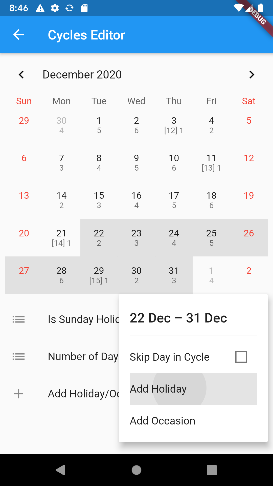
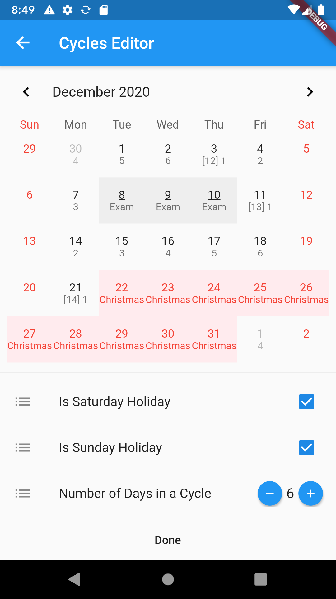
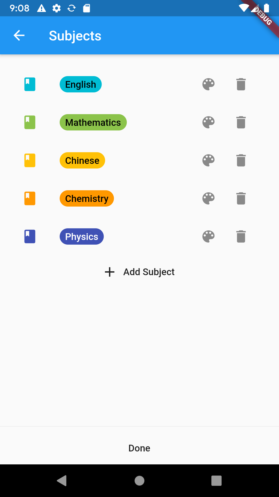
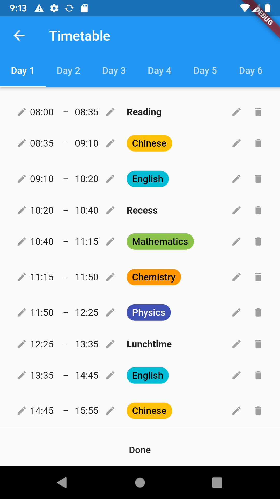
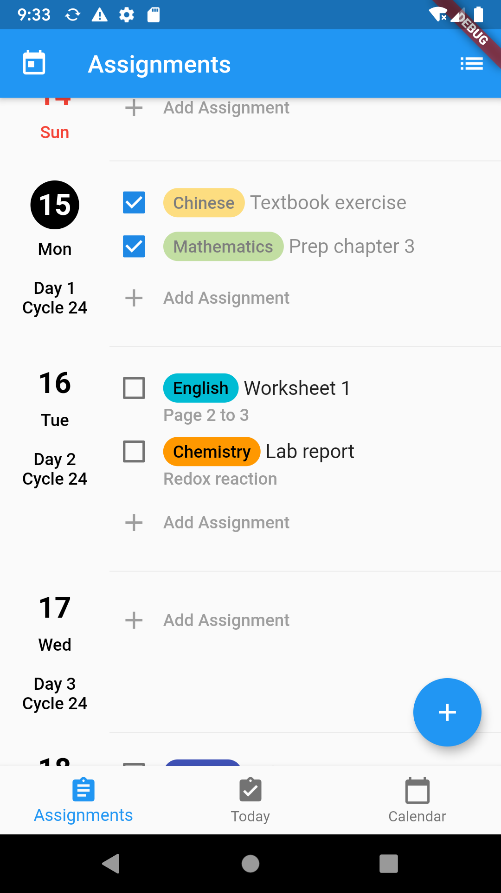
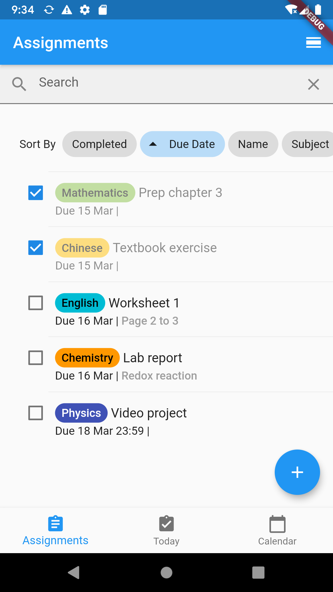
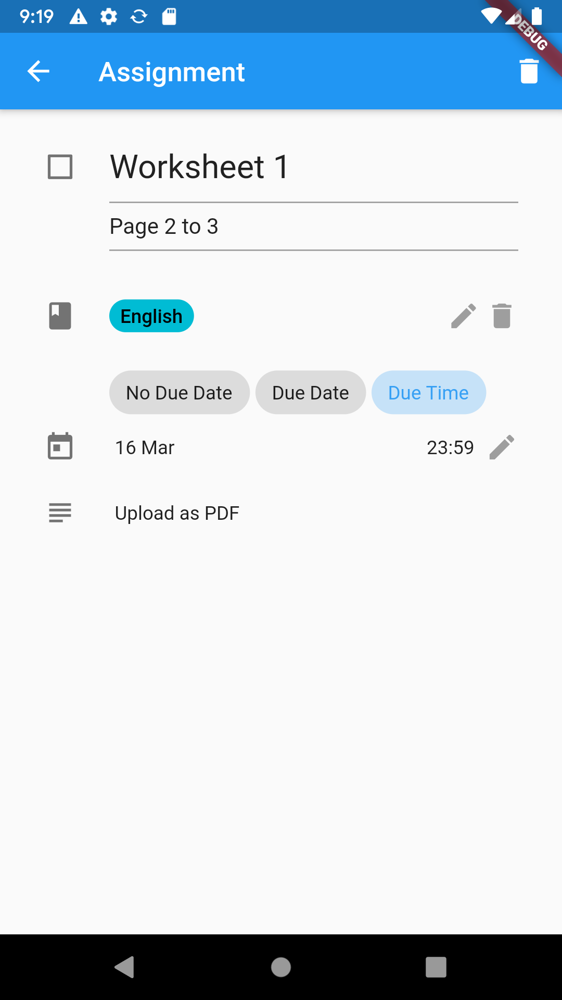
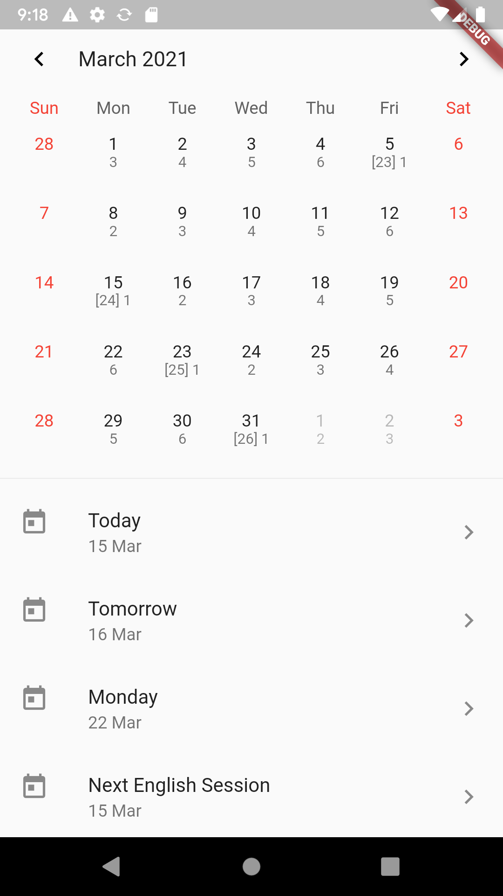
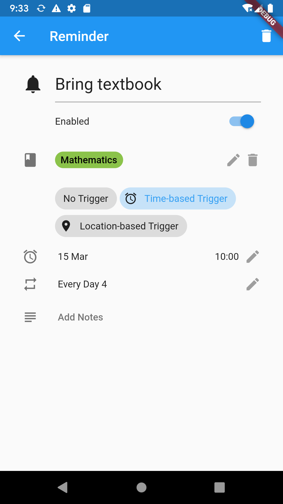
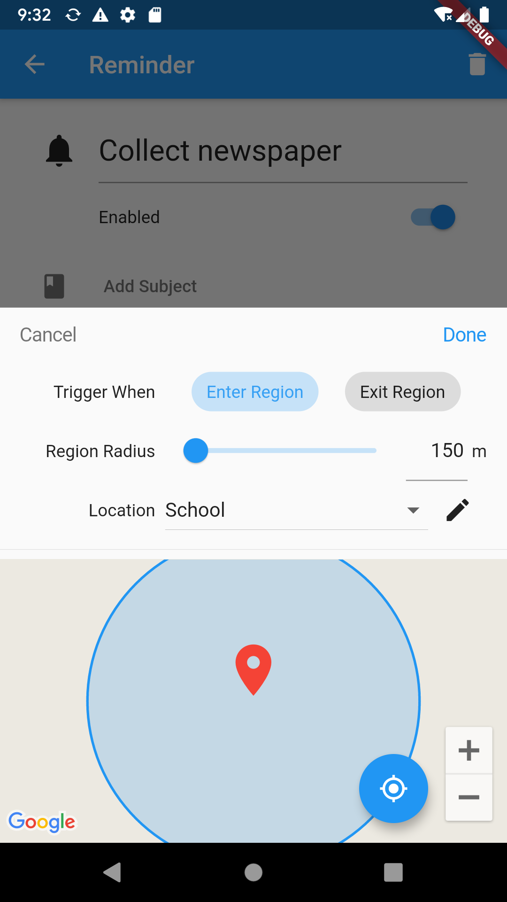

# Schooler

A Flutter app (iOS and Android) for school students to easily manage their calendar, timetable and tasks.

## Features
### Calendar
Manage holidays and occasions during the school year.
Both weeks and cycles-based calendars are supported.

### Subjects
The app allows categorising timetable sessions and tasks by subjects.

### Timetable
Assign a timetable to each weekday, cycle day or occasion.

### Today Tab
The Today tab is a dashboard of current events, including cycle information, today's timetable, upcoming assignments, and pending reminders.

https://github.com/user-attachments/assets/85721c54-6fac-4074-be9e-15f5d96196d7

### Assignments
In the Assignments tab, assignments are displayed in either a list view or a day view.
The description, subject and due date of an assignment can be modified.
When selecting a due date, the date picker provides common options such as the next lesson of the relevant subject.

### Reminders
Reminders can be created to deliver a notification at a certain condition.
Time-based and location-based triggers are available on both iOS and Android.

## Technical details
- This project uses [Flutter](https://flutter.dev/) 2.6.0 and [Dart](https://dart.dev/) 2.15.0.
    I have not since migrated the project to Dart 3, so the code does not have sound null safety.
- The logic of calendar generation is implemented in `lib/lib/cycle_week_config.dart`.
- Time-based reminders make use of [`flutter_local_notifications`](https://pub.dev/packages/flutter_local_notifications) to deliver notifications
    and [`workmanager`](https://pub.dev/packages/workmanager) for background code execution.
- Geofencing is implemented with [`CoreLocation`](https://developer.apple.com/documentation/corelocation/) on iOS
    and the [location APIs in Google Play services](https://developer.android.com/develop/sensors-and-location/location) on Android.
    [Platform channels](https://docs.flutter.dev/platform-integration/platform-channels) are used
    to bridge between the Flutter client and platform-specific implementations of geofencing.
